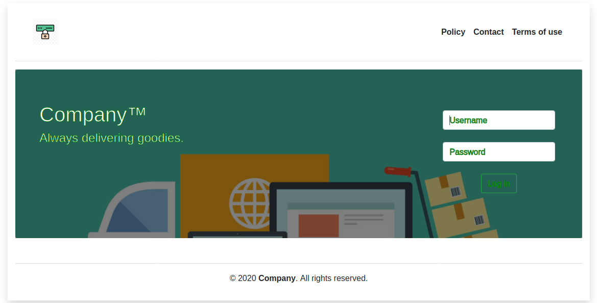

## Intrument Reservation System

This PHP project is an reservation system. Said instrument could presumably be a
photographic camera, for example. <br />
There are 2 types of users. An administrator or the one who controls the overall
system and standard users who rent the instruments for some specific time.<br />
It's fool-proof, to a degree.

Currently live at: https://instrument-reservation.herokuapp.com/



## Getting Started

This program was originally created under Windows 7 (x64) Operative System using<br />
PHP 5.6, Apache 2.4, Composer 1.10, MySQL 5.7, HTML5, Bootstrap 4 and jQuery 3.5.1.

## Prerequisites

I would advise only using official installers.

To install PHP:
https://www.php.net/manual/en/install.windows.manual.php

To install Apache server:
https://httpd.apache.org/download.cgi

To install Composer:
https://getcomposer.org/doc/00-intro.md

Also MySQL 5.7 is required:
https://dev.mysql.com/downloads/installer/

## Deployment

Before starting. Please rename the file '.env.default' to '.env', and set in your MySQL credentials.

1 - In order to link all composer dependencies:
```
./> composer i
[Writing lock file]
[Generating autoload files]
```
2 - Run your Apache server.

3- Then opening the website on **Google Chrome**(\*):

[localhost/Instrument-reservation-system/](localhost/Instrument-reservation-system/)

## Files

All files in this repository should be self explanatory.<br />
The most relevant files are:

***src/config.php:***<br />
holds the database configuration. Before running, please verify the database settings.

***src/calendar.php:***<br />
contains the graphical (and clickable) calendar. Pretty cool.

***src/success.php:***<br />
responsable for the entire back-end of the application. It re-routs, verifies inputs, database queries and more.

## Versioning

Version 1.6 - Current version<br />
Version 1.8 - Create an admin tab/page for instrument admin!<br />
Version 2.5(TBA) - Payment feature

## Author

Lucio Afonso

## License

This project is licensed under the GPL License - see the LICENSE.md file for details
